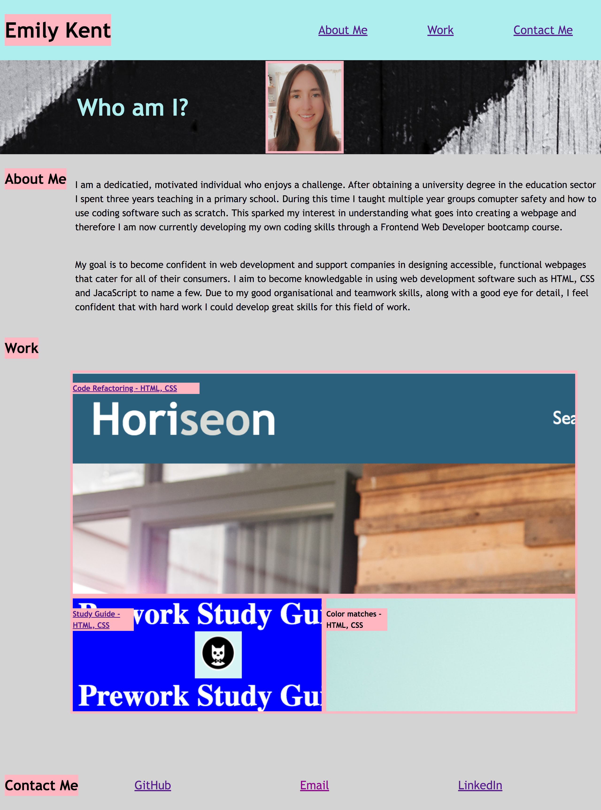
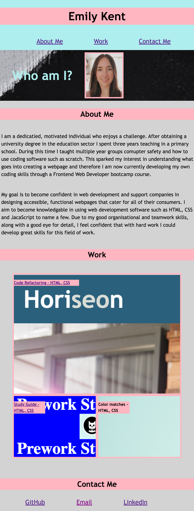
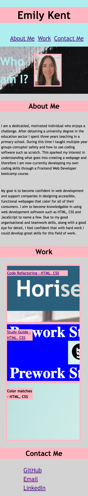

# Web-Developer-Portfolio

# Description
This portfolio was created so that an introduction to myself could be made along with a showcase of some of my previous projects. This portfolio is split into 3 sections; about me, work and contact. The motivation behind this project is to enable fellow coders to learn a little bit about me and the work I am capable of creating. This portfolio was created using HTML to organise the page into appropriate sections and CSS software to provide the portfolio with some styling.

# Installation
N/A

# Usage
This portfolio has a navigation bar at the top of the page with links to the corresponding sections. Underneath the navigation bar is a profile picture of myself followed by a couple of paragraphs detailing a little bit about me. The work section is organised into a grid with three images of projects that I have completed. These images, when clicked, have hyperlinks which will open up the deployed webpage. Finally, the end of the portfolio shows some contact details with hyperlinks to my GitHub and LinkedIn profiles.

This portfolio implements responsive web design and can be viewed on mobile, ipad and desktop devices.

Below are screenshots of the portfolio on a mobile device, an ipad and a desktop. 

To access this portfolio click the following link: https://embow24.github.io/Web-Developer-Portfolio/ 

# Credits
N/A

# License
MIT
